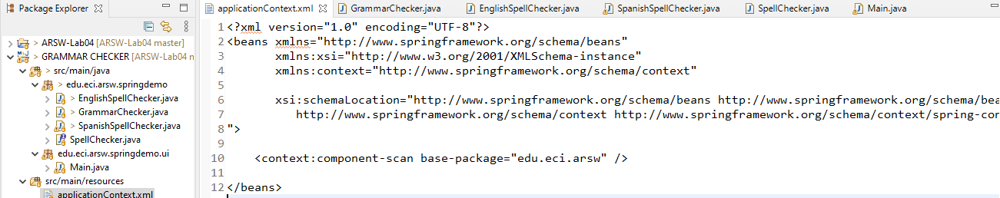
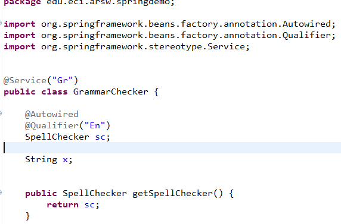
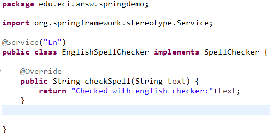
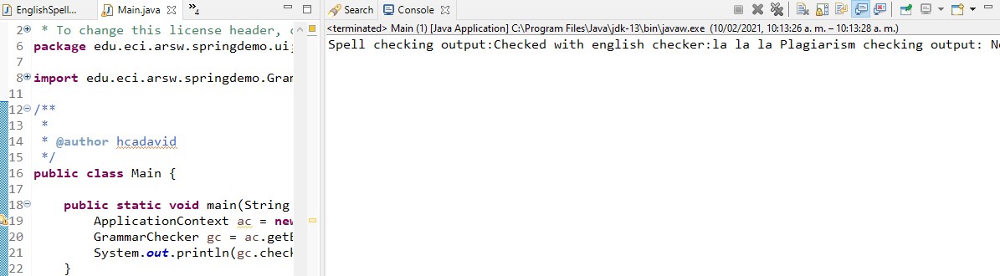
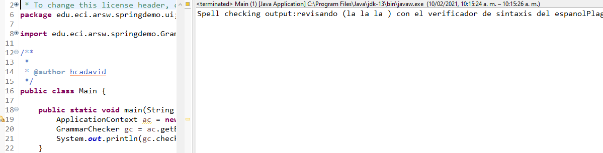

# ARSW - Laboratorio 4

## Laboratorio – Laboratorio Componentes y conectores Middleware- gestión de planos

## Integrantes:

- Eduard Arias
- James Torres

### Descripción
En este ejercicio se va a construír un modelo de clases para la capa lógica de una aplicación que permita gestionar planos arquitectónicos de una prestigiosa compañia de diseño.

### *PARTE Introductoria*

1.2. Se abrieron las fuentes y se reviso la configuracion de Spring.

 

3. se puso las anotaciones correspondientes en GrammarChecker para usarlo como Bean.

 

Se puso las anotaciones correspondientes para inyectar EnglishSpellChecker.

 

4. Prueba 

 

5. Usando SpanishSpellChecker 

 

### *PARTE I*

